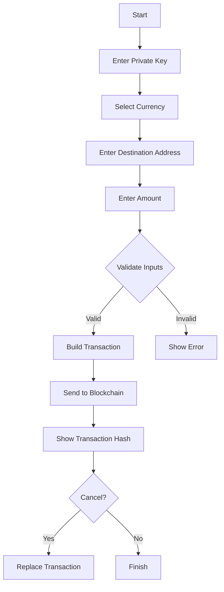

# 🚀 USDT Flash

  
**USDT Flasher Tools** is a graphical tool for sending and canceling ERC-20 token transactions on the Ethereum Mainnet. 💸

---

## 🎨 Features

- 🛠️ **Customizable Transactions**: Send ERC-20 tokens (USDT, USDC, DAI, etc.) to any Ethereum address.
- ⏳ **Pending Transactions**: Set minimal gas to keep transactions "stuck."
- 🛑 **Cancel Transactions**: Override a transaction with increased gas fees.
- 🖥️ **Intuitive Graphical Interface**: Designed with `tkinter` for a user-friendly experience.

---

## 📊 Flowchart



---

## 📝 How to Use

1. **Install Dependencies**:
   ```bash
   pip install web3 tkinter
   ```

2. **Configure Infura Project ID**:
   Replace `ID` in the `infura_url` variable with your Infura Project ID.

3. **Run the Script**:
   ```bash
   python USDT-Flasher.py
   ```

4. **Graphical Interface**:
   - Enter your private key and transaction details.
   - Click **Send Transaction** to send the transaction.
   - Click **Cancel Last Transaction** to override a pending transaction.

---

## 📋 Supported Tokens Table

| Token  | Contract Address                           | Decimals |
|--------|--------------------------------------------|----------|
| **USDT** | `0xdAC17F958D2ee523a2206206994597C13D831ec7`   | 6        |
| **WBTC** | `0x2260FAC5E5542a773Aa44fBCfeDf7C193bc2C599`   | 8        |
| **USDC** | `0xA0b86991c6218b36c1d19D4a2e9Eb0cE3606EB48`   | 6        |
| **DAI**  | `0x6B175474E89094C44Da98b954EedeAC495271d0F`   | 18       |
| **SHIB** | `0x95aD61b0a150d79219dCF64E1E6Cc01f0B64C4cE`   | 18       |

---

## 🚨 Warnings

1. **Private Key Security**: Never share your private key with anyone.
2. **Testnet Usage**: Test the script on a simulation network before using it on Mainnet.
3. **Legal Compliance**: Ensure compliance with local cryptocurrency regulations.

---

## 🤝 Contributions

Contributions are welcome! 🧑‍💻 Please open a pull request or report an issue in the [Issues](#) section.
